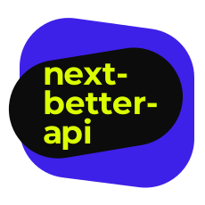

# next-better-api ⚡️🔵 [](https://badge.fury.io/js/next-better-api)

Opinionated TypeScript-first helpers for building better [NextJS](https://nextjs.org/) APIs, powered by [Zod](https://github.com/colinhacks/zod).

<p align="center">
  
</p>

## At a glance:

- 🙅‍♀️ Hands-off Typescript type inference based on your Zod validation schemas for query params, request body, and your API response
- ✨ Type inference helpers to use with `react-query`, `fetch`, and other client-side utilities
- 🔌 Minimal and composable &mdash; bring your own request context, use existing middleware, etc
- ☁ No additional dependencies (besides `zod` and `next` as `peerDependencies`, of course)

```ts
import { z } from 'zod';
import { endpoint, asHandler } from 'next-better-api';

const getUser = endpoint(
  {
    method: 'get',
    querySchema: z.object({
      id: z.string(),
    }),
    responseSchema: z.object({
      user: z.object({
        id: z.string(),
        name: z.string(),
        email: z.string(),
        active: z.boolean(),
      }),
    }),
  },
  async ({ query }) => {
    const user = await getUser(query.id);

    return {
      status: 200,
      body: {
        user,
      },
    };
  }
);

export default asHandler([getUser]);
```

## Installation:

> Skip to [API reference](./DOCS.md)

`next-better-api` requires `zod` for schema validation. You can install both libraries with yarn or npm on your existing NextJS project:

```shell
$ yarn add zod next-better-api

// OR

$ npm i -S zod next-better-api
```

And import it from your API definitions:

```ts
import { endpoint, asHandler } from 'next-better-api';
import { z } from 'zod'; // If you are defining schemas for your endpoints
```

Now simply define individual endpoints for each HTTP method in your existing API files,
and export your endpoints as a single `NextApiHandler`:

```ts
// pages/api/users.ts
const getUsers = endpoint(
  {
    method: 'get',
  },
  async () => {
    const users = await getUsersFromDb();

    return {
      status: 200,
      body: {
        users,
      },
    };
  }
);

export default asHandler([getUsers]);
```

## API Reference

See [DOCS.md](./DOCS.md)

For an example setup, [check out my starter template/example](https://github.com/filp/nextjs-app-starter).

---

## Stuff

See license information under [`LICENSE.md`](/LICENSE.md).

Contributions are super welcome - in the form of bug reports, suggestions, or better yet, pull requests!
